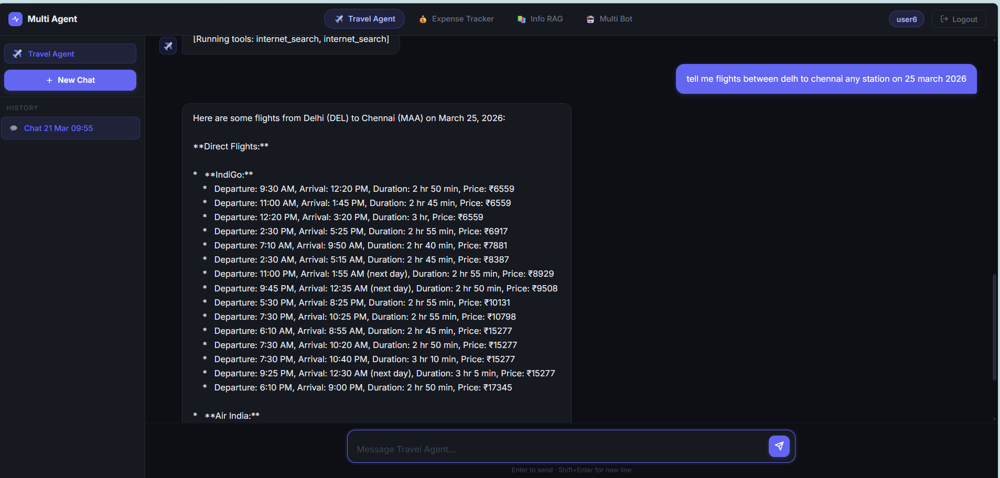
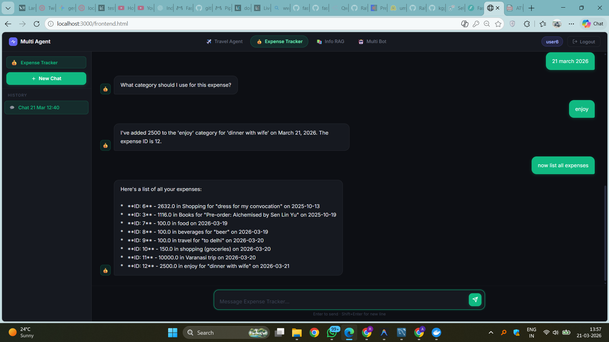
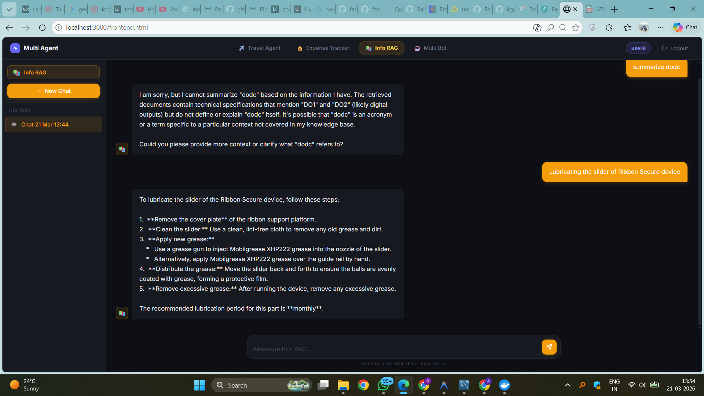
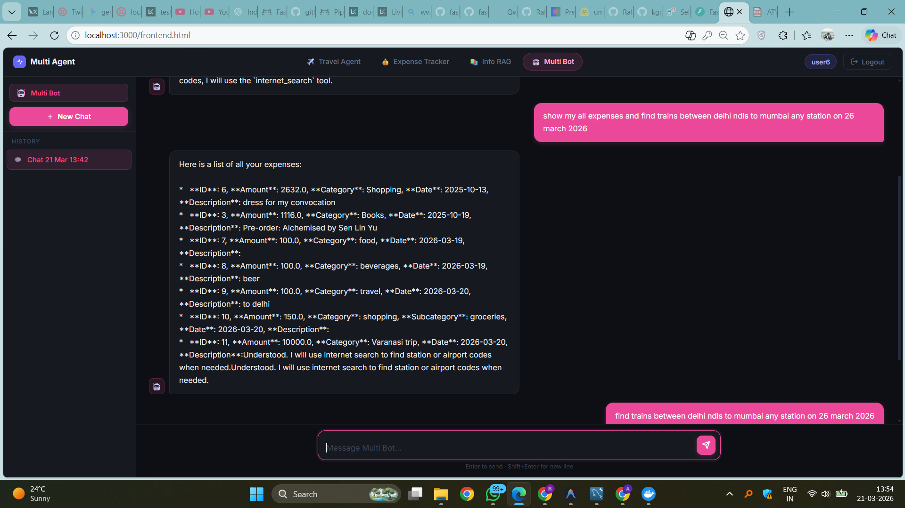

# Distributed-Multi-Agent-Intelligence-with-LangGraph-Orchestration

---

## 🧠 Overview

This project is a **multi-agent AI system** built using LangGraph that orchestrates multiple specialized agents into a single unified intelligence layer.

Instead of relying on a single AI system, this architecture combines multiple domain-specific agents (Travel, Expense, RAG) and coordinates them through a central reasoning system to solve complex user queries.

The goal is to move from **isolated AI agents → coordinated intelligent systems**.

---

## 🎯 Problem Statement

In real-world systems:

- AI agents are built independently  
- Each agent solves a specific task  
- There is no unified interface to use them together  
- Context is not shared between systems  
- Scaling multiple agents becomes difficult  

This leads to **fragmented intelligence and poor system coordination**.

## 💡 Solution

This project introduces a **multi-agent orchestration system** that:

- Combines multiple AI agents into a single system  
- Dynamically selects the correct agent based on user intent  
- Maintains conversation state using PostgreSQL  
- Enables tool-based reasoning using MCP  
- Supports real-time streaming responses  

👉 Result: A **coordinated AI system instead of isolated tools**

## 🤖 Agents Overview

### ✈️ Bot 1 — Travel Agent
- Provides train and flight information  
- Uses external tools via MCP  
- Handles route planning and travel queries  


### 💰 Bot 2 — Expense Tracker Agent
- Add, update, delete expenses  
- Category-based tracking  
- Query expenses with filters  
- Structured database interactions  


### 📚 Bot 3 — RAG Agent
- Retrieval-Augmented Generation  
- Answers queries from industry documents  
- Context-aware knowledge retrieval  



### 🧠 Bot 4 — Multi-Agent Supervisor (Orchestrator)
- Central decision-making agent  
- Routes queries to appropriate agents  
- Supports multi-step reasoning  
- Can use multiple agents for a single query  



## ⚙️ Key Features

- 🔁 Multi-agent orchestration  
- 🧠 Tool-augmented reasoning (MCP)  
- 💾 Persistent conversation memory (PostgreSQL)  
- ⚡ Streaming responses (SSE)  
- 🔄 Dynamic agent routing  
- 📡 LangGraph-based stateful workflows  
- 📚 RAG-based document querying  


## 🧠 Why Multi-Agent Systems?

Multi-agent systems break complex problems into smaller tasks handled by specialized agents and coordinate them efficiently. :contentReference[oaicite:0]{index=0}  

Orchestration ensures all agents collaborate toward a shared goal instead of working independently. :contentReference[oaicite:1]{index=1}  

This leads to:
- Better scalability  
- Improved accuracy  
- Modular system design  

---

## 🧩 Industry Relevance

This architecture is directly applicable in real-world systems where:

- Multiple AI systems need to work together  
- Different domains require specialized intelligence  
- Systems must scale without breaking existing workflows  

Examples:
- Enterprise AI copilots  
- Financial assistants  
- Customer support systems  
- Knowledge management systems  

Multi-agent orchestration allows organizations to move from isolated tools to **coordinated enterprise intelligence systems**. :contentReference[oaicite:2]{index=2}  

## 🛠️ Tech Stack

- Python  
- LangGraph  
- LangChain  
- FastAPI  
- PostgreSQL  
- MCP (Model Context Protocol)  
- Docker  

---

## ⚡ Getting Started

```bash
git clone https://github.com/your-username/repo-name
cd repo-name

pip install -r requirements.txt

